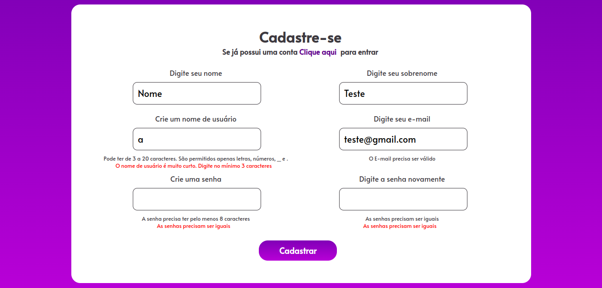
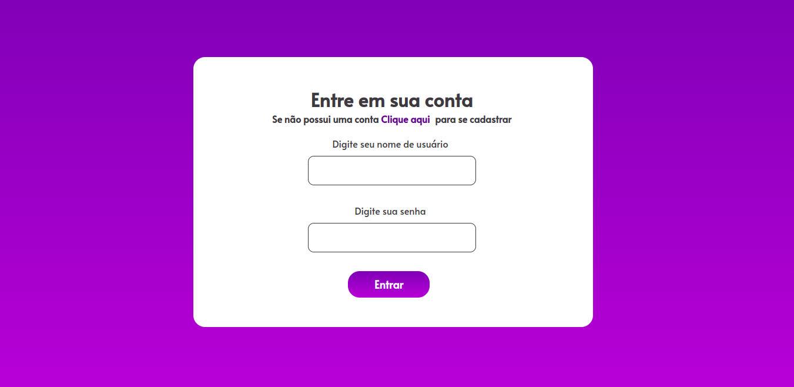
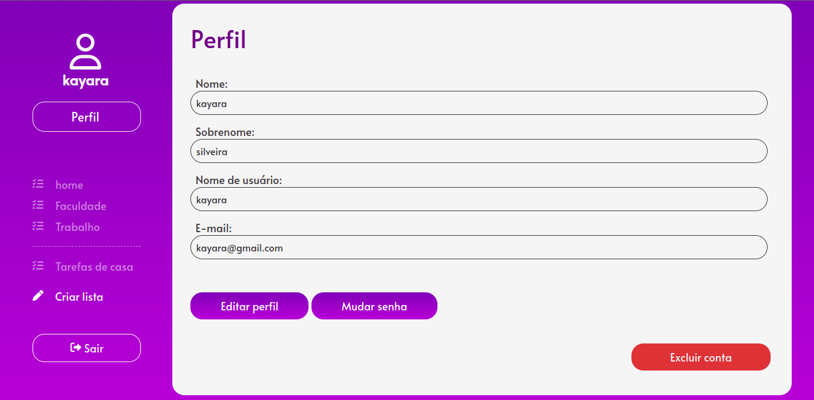
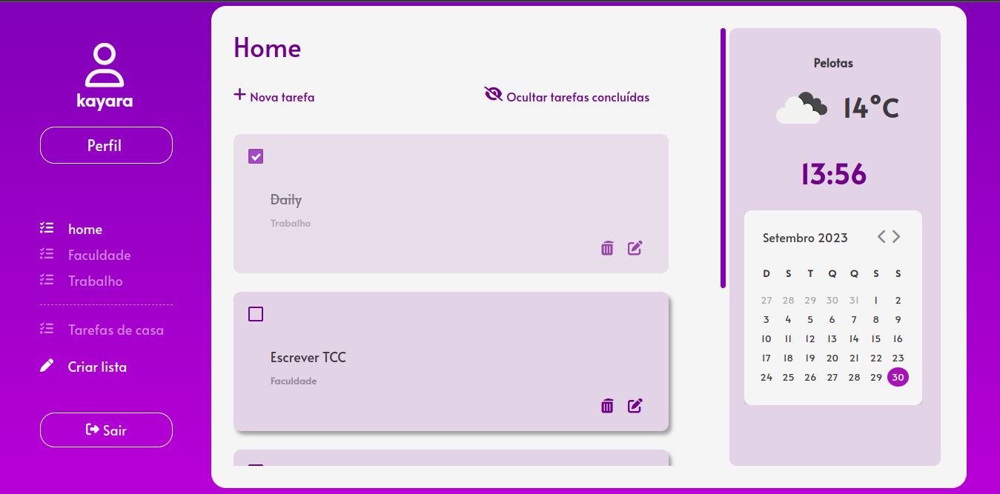
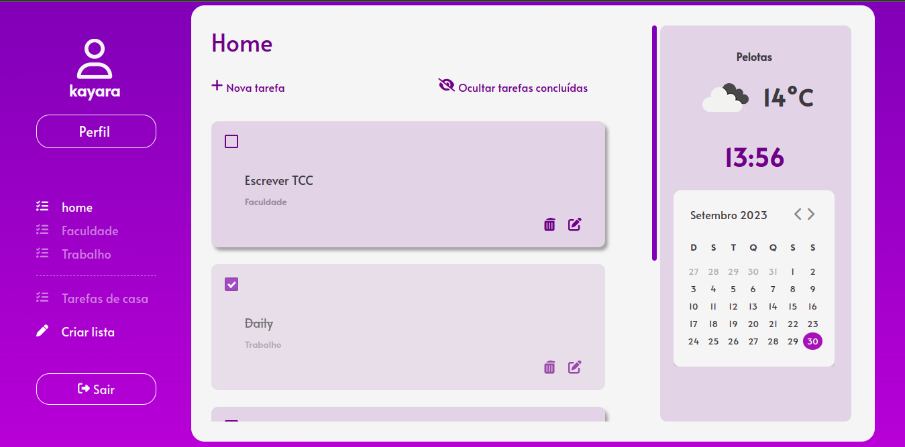
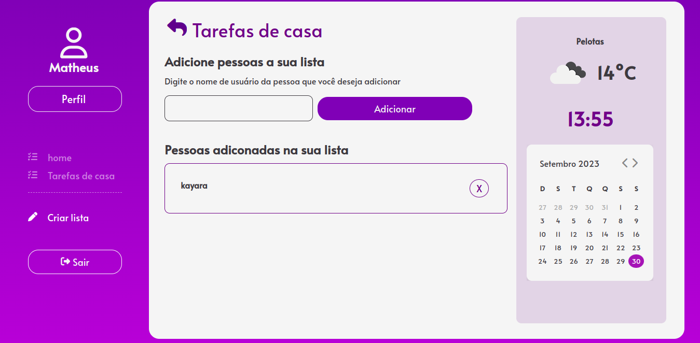

# To Do List

## Descrição

Este é um projeto de uma to do list realizada para a consolidação dos meus estudos de Django e Python.

## Funcionalidades Principais
- Cadastro, login, edição, mudança de senha e exclusão de perfil



- Criação, edição, exclusão, ordenação e marcação de tarefas como concluídas


- Criação de listas de tarefas particulares e criação de listas de tarefas compartilhadas



## Instalação

Para executar o projeto localmente, siga estas etapas:

1. Clone este repositório:
   ```bash
   https://github.com/KayaraSilveira/to-do-list.git
   ```
2. Crie e Ative o ambiente virtual:

No Windows 
```bash
   python -m venv venv
   venv\Scripts\activate
```

No macOS e Linux 
```bash
   python3 -m venv venv
   source venv/bin/activate
 ```

3. Instale as dependências
```bash
pip install -r requirements.txt
```

4. Crie o banco de dados
```bash
python manage.py migrate
```

5. Rode o servidor
```bash
python manage.py runserver
```

6. Acesse a url http://127.0.0.1:8000/
